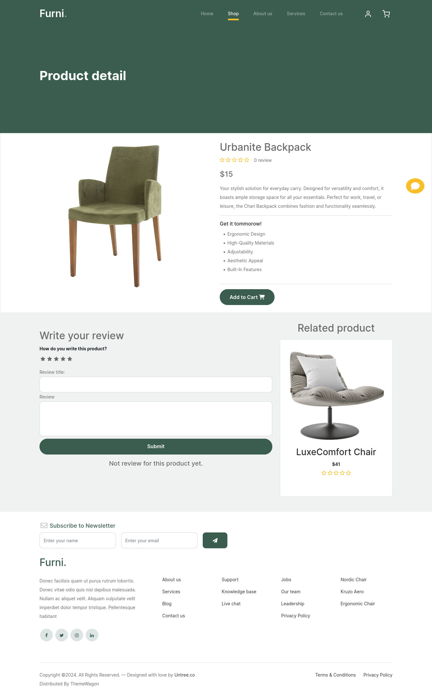
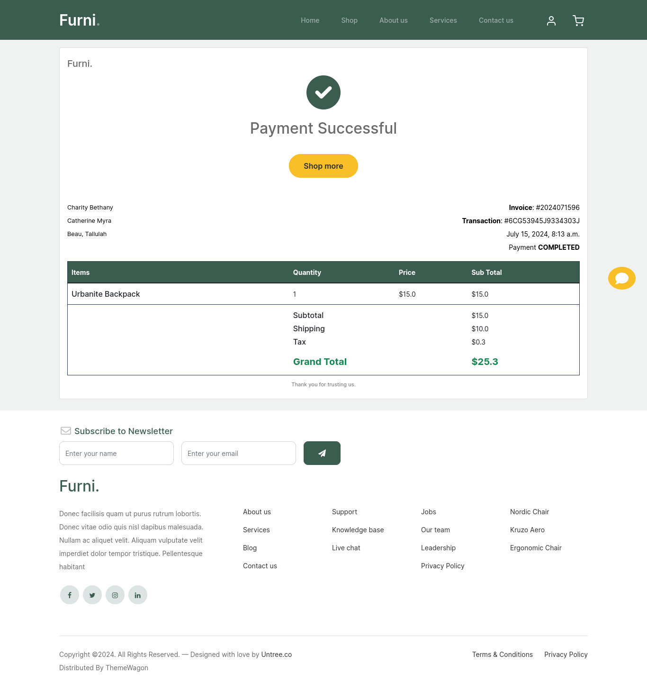

# 🌟 E-commerce Application with Customer Service Chatbot 🌟

This e-commerce application contains **`all the essential features`** found in a standard e-commerce website. Users can:

- 🛒 **Browse and view products**
- 🛍️ **Add products to their cart**
- 📦 **Place orders**
- 🗃️ **View their order history**
- 💳 **Make payments via PayPal**
- ✍️ **Write testimonials about the service**
- ⭐ **Write reviews about products**

## Preview

The backend includes **user registration and email verification** to ensure secure access. Additionally, the application features a customer service **`chatbot`** designed and trained to function as **`an assistant`**, capable of answering all user queries regarding:

- 📍 **Store location**
- ⏳ **Order delays**
- 🏬 **Store details**
- 💰 **Payment methods**
- 🚚 **Delivery**
- 🔒 **Warranty information**
- 🛠️ **And many more topics**

> **Note:** The chatbot's responses might be a bit weird since the training data was created/made up by a non-professional for demo purposes only. To achieve a professional and accurate customer service experience, assistance from experienced personnel is needed to create the training data.

The code for model creation and training can be found **[here](https://github.com/iramamy/ChatBot)**

The HTML template for this application is sourced from **[ThemeWagon](https://themewagon.com/themes/furni-online-store/)**.

